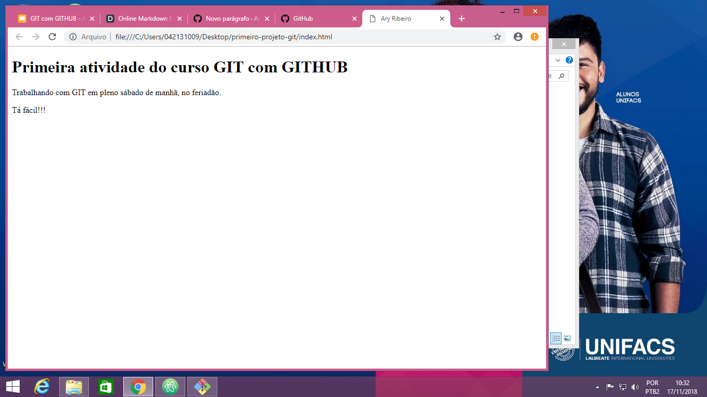

# Primeira atividade do curso de GIT com GITHUB

Atividade realizada no dia 17 de novembro de 2.018, na Unifacs Paralela!

  - Desenvolvedor : Ary Ribeiro
  - Instrutor : Victor Romário

### Descrição :
> Página simples em HTML, com o objetivo de exemplificar alteração, criação e submissão de um projeto no GITHUB, com o GIT.

Tecnologias utilizadas no projeto :
* HTML
* GIT (https://github.com/)
* Markdown

### Comandos do GIT aprendidos até aqui :

```sh

$ git config --global user.name "seu nome"

$ git config --global user.email "seu email"

Após a criação da pasta do projeto no computador :

$ cd Desktop/primeiro-projeto-git
$ git init
$ git status
$ git add .
$ git commit -m "mensagem"
$ git log
```

Sumissão para o GITHUB :

```sh

$ git remote add origin endereço HTTPS Repositório

$ git push -u origin master

```

### Imagem da Pagina

